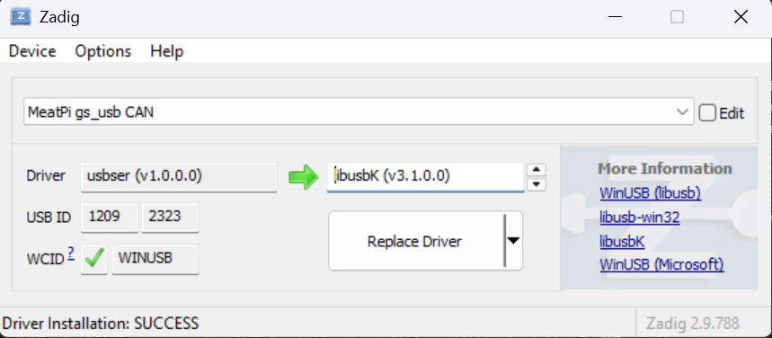

[www.meatpi.com](https://www.meatpi.com)
---
## MeatPi [Discord server](https://discord.gg/WXy8KQCE7V)
## Back this project on [**Crowd Supply!**](https://www.crowdsupply.com/meatpi-electronics/ollie-v2)

<br/><br/>

---


- [Pinout](#1-pinout)
- [Drivers](#2-drivers)
  - [Windows](#windows)
  - [Linux](#linux)
- [CAN](#3-can)
  - [CAN on Windows](#can-on-windows)
  - [CAN on Linux](#can-on-windows)
  - [GS USB (Recommended)](#gs-usb-recommended)
    - [GS CAN on Linux](#gs-can-on-linux)
    - [GS CAN on Windows](#gs-can-on-windows)
  - [API](#api)
- [Flash new Firmware](#4-flash-new-firmware)


# 1. Pinout


### Note: If the switch is set to VT then UARTA/B voltage must be set by target board. Otherwise VT pins will follow the voltage level set by the swtich.

# 2. Drivers

## Windows

[**Download**](https://github.com/meatpiHQ/meatpi_ollie_v2/files/12430011/ollie_v2_drivers_win.zip) and extract the ZIP file. After extraction, go to serial folder and run the SETUP.EXE file and click on the "Install" button. Then open the CAN folder right click on MEATPI_CAN.inf and click install.

If the installation is successful, the names of COM ports will change, each corresponding to its function.


## Linux

### UART
Follow the instruction to build and install [CH344 linux drivers](https://github.com/WCHSoftGroup/ch343ser_linux) 

**Note: By default Ollie-v2 will not work as USB CDC-ACM. If you need to use it as a CDC-ACM device you must remove resistor R20**


### Renaming ports
[**Download**](https://github.com/meatpiHQ/meatpi_ollie_v2/files/13810865/ollie_v2_drivers_linux.zip) and follow the instructions below.

```
sudo chmod +x ollie_v2.sh
sudo ./ollie_v2.sh     # This will create /dev/MEATPI-CAN0 /dev/MEATPI-RS232 /dev/MEATPI-RS485 /dev/MEATPI-UARTA /dev/MEATPI-UARTB
sudo slcand -o -s6 /dev/MEATPI-CAN0 can0     # s6: sets the speed to 500 Kbit 
sudo ifconfig can0 txqueuelen 1000
sudo ifconfig can0 up
```


**Speed commands:**
```
s1: 20 KBit
s2: 50 KBit
s3: 100 KBit
s4: 125 KBit
s5: 250 KBit
s6: 500 KBit
s7: 800 KBit
s8: 1 MBit
```

# 3. CAN

## CAN on Windows

You can use BUSMaster for CAN Bus monitoring. Please download this version of BUSMaster provided in the [**Link**](https://drive.google.com/drive/folders/1ZuAvOhjXHvq5TKOJofSgyZFOzkQ3mTIc) above. Here is how to setup the hardware. 
1. Select VSCom CAN-API by clicking on 'Driver Selection -> VSCom CAN-API"
2. Then Click on 'Channel Configuration -> Advanced' 
3. Click on 'Search for Devices on COM-Ports', the device should appear in the drop downlist or fill the right COM port number
4. Check the 'Hardware Timestamps' check box.
5. Choose the Baudrate.
6. Click 'OK', then Click the Connect button on the top left corner.


## CAN on Linux

SocketCAN is a Linux-based socket interface for CAN bus communication. It provides a standardized API for accessing CAN hardware and a set of utilities for working with CAN devices. SocketCAN supports multiple CAN controllers and can handle different types of CAN buses, such as CAN 2.0A and CAN 2.0B.

Follow the [instructions](#linux) to bring up the CAN interface.

**To send a single frame, use the cansend utility:**
```
cansend can0 123#1122334455667788
```

**To display in real-time the list of messages received on the bus, use the candump utility:**
```
candump can0

# can0  123   [8] 11 22 33 44 55 66 77 88
```
## GS USB (Recommended)

Ollie-v2 implements the `gs_usb` (candleLight) protocol, which exposes the adapter as a native CAN interface to `python-can`. This is the **recommended** way to use Ollie-v2 for CAN work.

Unlike the slower serial-line (slcand/SLCAN) path, `gs_usb` talks to the adapter over a dedicated USB bulk interface. This gives you significantly higher throughput, lower latency and accurate hardware timestamps — performance that matches, and in many cases beats, expensive high-end CAN adapters, at a fraction of the cost.

### GS CAN on Linux

```bash
pip install python-can
```

Bring the Linux CAN interface up before running the script, for example:

```bash
sudo ip link set can0 up type can bitrate 500000
```

### GS CAN on Windows

```powershell
pip install "python-can[gs-usb]"
```

On Windows, the GS USB interface also needs a libusb-compatible driver such as `libusbK`.

#### Zadig setup

1. Download and open Zadig: https://zadig.akeo.ie/
2. Plug in the MeatPi adapter and start the `gs_usb` firmware.
3. In Zadig, enable **Options -> List All Devices**.
4. Select **MeatPi gs_usb CAN** (USB ID `1209:2323`) from the device list.
5. Choose **libusbK** as the target driver.
6. Click **Replace Driver** or **Install Driver**.

When Zadig reports **Driver Installation: SUCCESS**, you're ready to go.



After Zadig finishes, unplug and reconnect the adapter, then run the Windows GS CAN example.

## API

- [API Documentation](https://drive.google.com/drive/folders/1qJelUAHGrn_YbNIP0Jk_KmNENG-hKbtl?usp=sharing)
- [Programing examples](https://github.com/meatpiHQ/programming_examples/tree/master/CAN)

# 4. Flash new Firmware

1. While pressing the push button, plug in the USB-C cable.
2. The Blue LED should start blinking
3. Once in DFU mode, the device will appear as "USB Serial Device"
4. If you have multiple USB Serial devices connected make sure to choose the right one
5. Click the "Three Dots" button to select the firmware file
6. Then Click flash button.


